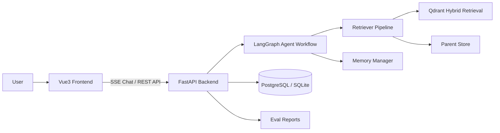

# Agentic RAG QA Studio

基于 LangGraph 的可观测智能文档问答平台，面向企业制度、技术文档、学习资料等非结构化知识库场景，支持文档上传、权限隔离、流式问答、来源追溯、多轮记忆、检索诊断和批量评测。


## 项目亮点

- Agentic RAG 工作流：使用 LangGraph 编排历史摘要、问题改写、动态路由、多子问题并行检索和答案聚合。
- Hybrid Retrieval：基于 Qdrant 实现 Dense Embedding + BM25 Sparse 混合召回。
- Parent-Child Chunking：Child Chunk 用于精准召回，Parent Chunk 用于补全回答上下文。
- 多租户知识库：支持 JWT 鉴权、用户/管理员角色、私有/公共文档空间、分类过滤和上传配额。
- 可观测问答：前端展示 Source 引用、Query Analysis、Retrieval Trace、selected/rejected 候选片段和检索配置。
- 记忆系统：支持短期会话 checkpoint、滑动窗口、滚动摘要、用户画像和长期事实记忆。
- 评测闭环：提供批量 RAG 评测脚本，支持 HTTP/local 模式、检索参数对比和 JSON/Markdown 报告输出。

## 技术栈

| 模块 | 技术 |
| --- | --- |
| 后端服务 | Python, FastAPI, SSE, Pydantic |
| Agent 编排 | LangGraph, LangChain, Tool Calling |
| 检索增强 | Qdrant, Hybrid Search, Parent-Child Chunking, Rerank |
| 数据持久化 | PostgreSQL, SQLite checkpoint, Parent Store |
| 前端 | Vue 3, Vite, Pinia, Element Plus |
| 工程化 | Docker, Docker Compose, pytest |

## 系统架构



## 核心流程

### 文档入库

1. 用户上传 PDF/Markdown 文档。
2. 系统将文档转换或保存为 Markdown。
3. 按 Markdown 标题切分 Parent Chunk，再递归切分 Child Chunk。
4. Child Chunk 写入 Qdrant，用于混合检索召回。
5. Parent Chunk 写入 Parent Store，用于回答阶段补全上下文。
6. 文档元数据写入数据库，支持用户隔离、分类过滤和生命周期管理。

### 问答链路

1. 前端通过 SSE 发起流式问答请求。
2. LangGraph 读取会话历史，生成滚动摘要。
3. Query Rewrite 节点识别用户问题是否清晰，并将复杂问题拆分为多个子问题。
4. 动态路由节点为每个子问题启动 Agent 子图。
5. Agent 通过检索工具调用 Qdrant，获得候选 Child Chunk。
6. 检索流水线执行 rerank、阈值过滤、去重和上下文预算控制。
7. 系统根据 parent_id 回查 Parent Chunk，组装最终上下文。
8. 聚合节点合成最终答案，并返回引用来源、检索 trace 和元信息。

## 功能模块

### 1. Agentic RAG 工作流

- 历史摘要：压缩多轮对话，避免上下文无限增长。
- Query Rewrite：结合历史上下文改写模糊问题，支持复杂问题拆解。
- 动态路由：针对多个子问题并行执行 Agent 子图。
- ReAct 子图：通过工具调用完成检索、上下文补全和回答生成。
- 稳定性控制：限制最大迭代次数和工具调用次数，提供 fallback 兜底回答。
- 检索去重：记录已执行搜索和已读取 Parent Chunk，减少重复检索。

### 2. 可追踪检索流水线

- Qdrant Hybrid Retrieval：结合语义向量召回与 BM25 稀疏召回。
- Tenant Filter：按用户、公共文档空间和分类构建检索过滤条件。
- Rerank：支持外部 rerank provider，对候选片段重新排序。
- Context Assembler：按 parent_id、内容重复度、分数阈值和 token 预算筛选上下文。
- Retrieval Trace：输出候选片段、入选片段、拒绝原因、分数、阈值和检索配置。

### 3. 多租户知识库

- JWT 登录鉴权。
- 用户和管理员角色。
- 私有文档与公共文档空间。
- 文档分类过滤。
- 上传大小和数量配额。
- 删除文档时联动清理 Markdown、Parent Store、向量索引和元数据。

### 4. 记忆系统

- 短期记忆：基于 LangGraph checkpoint 保存会话状态。
- 对话摘要：保留关键历史上下文，减少模型输入长度。
- 用户画像：保存偏好、规则和长期个性化信息。
- 长期事实记忆：从问答中异步抽取事实，后续对话中按需注入。
- 记忆管理页：支持查看、筛选和清理记忆。

### 5. 可观测前端

- SSE 流式问答体验。
- 会话列表、重命名、删除和历史记录查看。
- Source 引用面板。
- Query Analysis 面板。
- Retrieval Trace 面板。
- 文档管理和上传进度。
- 评测报告列表与详情查看。

## 快速开始

### 1. 克隆项目

```bash
git clone https://github.com/lqc3413/agentic-rag-for-dummies.git
cd agentic-rag-for-dummies
```

### 2. 准备后端环境

```bash
python -m venv .venv
.\.venv\Scripts\activate
pip install -r requirements.txt
```

### 3. 配置环境变量

复制示例配置：

```bash
copy project\.env.example project\.env
```

至少需要配置以下变量：

```env
LLM_PROVIDER=openai_compatible
LLM_MODEL=your-chat-model
OPENAI_COMPATIBLE_API_BASE_URL=your-chat-api-base-url
OPENAI_COMPATIBLE_API_KEY=your-chat-api-key

EMBEDDING_PROVIDER=openai_compatible
DENSE_MODEL=your-embedding-model
EMBEDDING_API_BASE_URL=your-embedding-api-base-url
EMBEDDING_API_KEY=your-embedding-api-key

RERANK_ENABLED=true
RERANK_PROVIDER=zhipu
RERANK_API_KEY=your-rerank-api-key
```

如果使用 Docker Compose 中的 PostgreSQL，默认数据库连接会通过 `docker-compose.yml` 注入。若本地运行后端，请确保本地 PostgreSQL 可用，或按需修改 `PG_HOST`、`PG_PORT`、`PG_USER`、`PG_PASSWORD`、`PG_DB`。

### 4. 启动后端

```bash
python -X utf8 -m uvicorn backend.main:app --host 127.0.0.1 --port 8000
```

健康检查：

```text
http://127.0.0.1:8000/api/health
```

### 5. 启动前端

```bash
cd frontend
npm install
npm run dev -- --host 127.0.0.1 --port 5173
```

访问：

```text
http://127.0.0.1:5173
```

## Docker Compose 启动

```bash
docker compose up --build
```

默认服务：

- 前端：http://localhost
- 后端：http://localhost:8000
- PostgreSQL：localhost:5432

## 测试与评测

运行测试：

```bash
pytest tests
```

运行 RAG 评测：

```bash
python eval/run_rag_eval.py --mode http
```

评测报告会生成到 `eval/reports/`，该目录默认不提交具体报告文件，仅保留 `.gitkeep`。

## 项目结构

```text
.
├── backend/                 # FastAPI 接口、鉴权、SSE 流式问答
│   ├── routers/             # auth/chat/documents/memory/eval reports
│   └── services/            # ChatService 等业务服务
├── frontend/                # Vue3 + Vite 前端
│   └── src/
│       ├── api/             # API 请求封装
│       ├── components/      # 问答、文档、布局组件
│       ├── stores/          # Pinia 状态管理
│       └── views/           # 页面视图
├── project/
│   ├── core/                # RAGSystem、DocumentManager、Observability
│   ├── db/                  # 用户、文档、记忆、QA 记录、向量库管理
│   ├── rag/                 # RetrieverPipeline、rerank、上下文组装
│   └── rag_agent/           # LangGraph 节点、边、工具和提示词
├── eval/                    # 评测用例、评测脚本和报告目录
├── tests/                   # 单元测试与接口测试
├── assets/                  # 架构图、演示图等静态资源
├── docker-compose.yml
├── Dockerfile.backend
└── requirements.txt
```

## GitHub 推送说明

以下文件和目录属于本地运行数据，不应该提交到仓库：

- `.venv/`
- `qdrant_db/`
- `markdown_docs/`
- `parent_store/`
- `logs/`
- `temp_downloads/`
- `backend/temp_uploads/`
- `*.db`
- `*.db-wal`
- `*.db-shm`
- `project/.env`
- `eval/reports/*.json`
- `eval/reports/*.md`

仓库只保留源码、测试、示例配置和必要的静态展示资源。真实 API Key、用户数据、问答记录和向量索引都应保存在本地或部署环境中。

## 后续优化方向

- 增加更多 embedding 和 rerank provider 的配置模板。
- 引入对象存储保存上传原文和转换后的 Markdown。
- 扩展评测集规模，加入多跳问答、拒答、权限隔离等专项用例。
- 增加端到端压测和延迟统计。
- 接入更完整的生产级日志、监控和告警。
